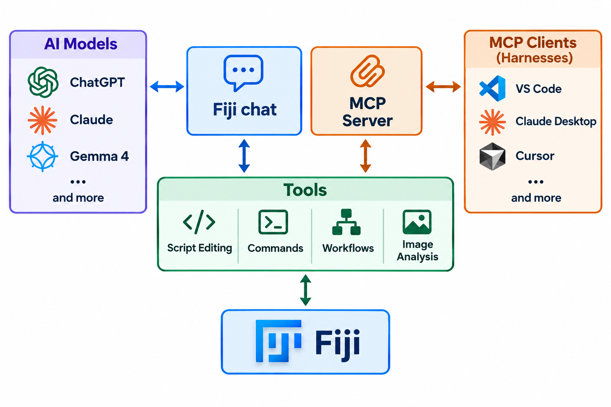

# Fiji Large Language Model (LLM) Integration

This project brings extensible, reproducible AI assistance into Fiji, helping scientists discover tools, build image analysis workflows, and connect with both local and external language models.

## From a User's Perspective



Fiji-LLM was developed to help users access Fiji's capabilities through natural-language interaction, while allowing them to choose the AI model that best fits their needs.

## Core Goals

* **Make Fiji More Accessible:** Help scientists discover relevant tools, learn unfamiliar workflows, and create reusable scripts through guided natural-language interactions.

* **Enable Reproducible Agentic Workflows:** Give AI agents structured access to Fiji’s application context and core capabilities, with an emphasis on generating familiar scripts and macros rather than de novo workflow formats.

* **Provide an Extensible AI Foundation:** Establish shared extension points for agentic tools and model connectivity so that developers can add new capabilities without creating isolated or incompatible integrations.

* **Support Private and Equitable Model Access:** Make local, open-weight models a first-class option while retaining flexible connectivity to external model providers and AI clients.

## Key Architecture and Components

* **In-App Chat Interface:** Provides scientists with guided AI assistance directly inside Fiji.

* **Model Context Protocol (MCP) Server:** Exposes Fiji’s agentic tools to compatible external assistants, development environments, and other MCP clients.

* **Annotated Tool Registry:** Uses the SciJava plugin framework to dynamically discover and register capabilities that developers expose to AI agents.

* **Extensible Model Engine:** Separates model connectivity from agentic functionality, allowing new local or remote model providers to be added through plugins.

* **Context-Aware Analysis Tools:** Give agents structured access to Fiji’s environment, including installed commands, open images, analysis metadata, the Script Editor, and macro recorder.
* **ImageJ Data Inspection:** Provide structured access to common ImageJ data objects, including Results Tables and the ROI Manager.
* **Shared Fiji Guidance:** Provide bounded, curated onboarding and workflow guidance to both integrated chat and external MCP clients without injecting the full documentation corpus into every request.

## Table of Contents
- [Fiji Chat Quick Start](#fiji-chat-quick-start)
- [MCP Server](#mcp-server)
  - [VS Code](#vs-code)
- [User Guide](#user-guide)
  - [Basic Concepts](#basic-concepts)
  - [Supported AI Providers](#supported-ai-providers)
  - [General Work Flow](#general-work-flow)
  - [Using Tools](#using-tools)
  - [Tips for Better Results](#tips-for-better-results)
  - [Getting Help](#getting-help)
- [Developers: Adding Functionality](#developers-adding-functionality)
  - [LLMProvider](#llmprovider)
  - [ContextItemSupplier](#contextitemsupplier)
  - [AiToolPlugin](#aitoolplugin)
    - [Tool Best Practices](#tool-best-practices)
  - [Integration Testing](#integration-testing)
  - [ChatbotService](#chatbotservice)
- [FAQ](#frequently-asked-questions)

## See Also
- [Technical Summary](doc/TECHNICAL_SUMMARY.md)
- [Shared Guidance Architecture](doc/GUIDANCE_ARCHITECTURE.md)

<a id="quick-start"></a>

## Fiji Chat Quick Start

1. **Install Fiji**: Download the `Latest` version from [imagej.net/software/fiji](https://imagej.net/software/fiji/)

2. **Add the Fiji-chat Update Site**:
   - See [instructions on adding unlisted update sites](https://imagej.net/update-sites/following#adding-unlisted-sites).
   - Add the (*currently unlisted*) `Fiji-chat` site: `https://sites.imagej.net/Fiji-chat/`
   - Restart Fiji afterwards

3. **Open the chat**: Run `Help > Assistants > Fiji Chat...` (shortcut: `ctrl + 0`)
	- The first time you run `Fiji Chat...` you will see a landing page where you select an AI Service and model.
    - Future `Fiji Chat...` runs will go right to chatting with your last selected service and model.

4. **Select a model**:

	**Option A: Local Models (Recommended for beginners)**
	- These are open models which run on your machine.
	- Download and install [Ollama](https://ollama.com/download) now (no Fiji restart needed)
  - We recommend starting with the curated `Gemma4 (Ollama)` service, which offers XS, S, M, and L aliases for different hardware configurations.
	- The general `Ollama` service allows for full model exploration.
	- Click `OK` to start chatting. You will need to wait for the selected model to download (only on first chat with a model)

	**Option B: Cloud Models**
	- If you have an account with an AI service (Gemini, Claude, ChatGPT, etc.) you can use it with Fiji chat. Most services require paid subscriptions or credits for this function.
	- Select your provider, then choose an available model. Different models have different pricing schemes.
	- Click `OK` to start chatting. You will be prompted for an API key and provided with a link to your provider's key page (only on first chat with a remote provider)

	**Want to switch later?** Use the ⚙️ button in chat to change models and/or providers.

## MCP Server

### Quick Start

To use the Fiji LLM tools from an external harness:
1. From an open Fiji, run `Help > Assistants > Manage Fiji MCP Server...`
1. Change the port from default 9090 if necessary
1. Click `Start Server` if it's not already running
1. Turn on `Launch MCP on Startup`
1. Add the Fiji MCP server configuration to the harness of your choices
1. Optionally, use the `Copy` selector appropriate to your use case. If you're not sure how to set this up, the agent in your particular harness application can often help.

### Overview

Most LLM tools in Fiji are accessible via an [MCP Server](https://en.wikipedia.org/wiki/Model_Context_Protocol). Tools scoped for integrated chat only are not exposed to external MCP clients. This can allow access to hosted models through external harness applications, potentially bypassing the need for an API key or local model.

The MCP server is tied to a live Fiji application, which is where any tools will execute. When Fiji and the MCP server are running, it can be accessed at `http://localhost:9090/mcp` (using the default port 9090)

In the `Manage Fiji MCP Server...` dialog, the following settings and actions are available
- **Set Port** (or set preferences key `sc.fiji.mcp.port`)
- **Start Server**
- **Launch on startup** (or set preferences key `sc.fiji.mcp.launchOnStartup` to true)
- **View Tools...**: browse available tools, grouped by category
- **Copy Connection Details**: Copy the URL, a Claude Code registration command, or a VS Code `mcp.json` configuration, as needed for your environment

### VS Code

You can connect your VS Code LLMs to the Fiji MCP server! This allows your agents to run tasks in a local Fiji. The quickest setup is to open the Command Palette, run `MCP: Add Server`, and follow the guided HTTP-server setup. See the [VS Code MCP server documentation](https://code.visualstudio.com/docs/agent-customization/mcp-servers) for workspace and user configuration details.

For manual setup, start Fiji, choose `VS Code Config` from the `Copy:` selector in the `Manage Fiji MCP Server...` dialog, and paste the copied configuration into your `.vscode/mcp.json` or user MCP configuration. The copied URL reflects any custom port configured for Fiji.

In your chat `Configure Tools` dialog, you should see a new `fiji-mcp-server` option that you can toggle on or off.

You may also want to update your `settings.json` and add:
```json
	"chat.mcp.autostart": "newAndOutdated"
```

Because the Fiji MCP server is dynamic, being tied to a running Fiji instance, your agent will receive errors trying to use Fiji tools when Fiji is closed. But this setting should allow it to reconnect when Fiji is running again. It also will restart its MCP connection after the tool definition cache is cleared. If you prefer to manually manage this connection, set `autostart` to `never`.

You should run `MCP: Reset Tool Caches` any time deployed tools are revised.

You can manually check and manage MCP server status with `MCP: List Servers`, as well.

**NB**: Your local Fiji application must be running first for the MCP server to be findable by VS Code. For best results, (re)start the server from `mcp.json` after launching Fiji.

### Claude Code

Claude Code can register the running Fiji server from a terminal, or in a local `.mcp.json`, or `~/.claude.json`. See the [Claude Code MCP documentation](https://code.claude.com/docs/en/mcp) for HTTP server setup, configuration scopes, and server management.

#### Custom Agent and Skill

This repository includes a VS Code agent and Fiji workflow skills in
`.github`, where VS Code can discover project-scoped customizations when this
repository is opened:

- [`.github/agents/fiji-mcp.agent.md`](.github/agents/fiji-mcp.agent.md)
- [`.github/skills/fiji-script-workflow/`](.github/skills/fiji-script-workflow/)
- [`.github/skills/fiji-macro-workflow/`](.github/skills/fiji-macro-workflow/)

Discovery makes the agent and skill available to this workspace; it does not
automatically select the agent or load the skill for every conversation.

For personal use across workspaces, prefer symlinking these project files into
the VS Code user-level discovery paths:

- `.github/agents/fiji-mcp.agent.md` -> `<VS Code user profile>/prompts/fiji-mcp.agent.md`
- `.github/skills/fiji-script-workflow/` -> `~/.copilot/skills/fiji-script-workflow/`
- `.github/skills/fiji-macro-workflow/` -> `~/.copilot/skills/fiji-macro-workflow/`

Prefer symlinking these destinations to the files in this checkout when the
platform supports it, so updates are picked up immediately. Copy the files when
symlinking is unavailable. The skills guide Fiji script and macro authoring,
execution, diagnosis, repair, and verification workflows.

## User Guide

### Basic Concepts

**AI Service Providers** - Companies that provide cloud-based access to trained language models.

**Models** - Specific language models offered by a provider (e.g., GPT-4o, Claude 3.5 Sonnet). Different models have different capabilities and costs.

**Tokens** - The unit of operation within an LLM: messages to and from the chatbot are encoded as a series of "tokens". Longer messages require more tokens. Importantly, any *actions taken* by the LLM in response to your message will use tokens. (such as editing a script or running a command)

**API Keys** - Credentials that authenticate you with an AI service provider. Often require per-token pay-as-you-go or a subscription plan.

**Conversations** - Your chat history with an AI assistant, independent of model. Conversations are saved locally and loaded when Fiji starts, so you can continue working where you left off. Each conversation has a stable UUID identity and an optional display name; new conversations initially show their UUID and can be named once by the assistant from their history. In long conversations, the model may not "see" the whole chat history.

**Context Items** - Information you can attach to chat message that helps the assistant understand your Fiji environment. For example, you could attach an open image or script.

Image rendering is kept separate from persisted context metadata. The reusable
`ImageRenderingService` captures the current displayed plane and display state,
creates a bounded PNG `ImageContent` payload, and returns its image metadata
separately. Optional ROI drawing uses the active legacy ImageJ ROI when that
bridge is available.

### Supported AI Providers

#### Provider health

These badges are updated daily by the [provider health workflow](https://github.com/fiji/fiji-llm/actions/workflows/provider-health.yml).
`review models` means that the provider documentation changed or its URL state
changed; re-evaluate the models supplied by that provider and update its recorded
documentation date.

| Provider | Status |
| --- | --- |
| ChatGPT | [](https://github.com/fiji/fiji-llm/actions/workflows/provider-health.yml) |
| Claude | [](https://github.com/fiji/fiji-llm/actions/workflows/provider-health.yml) |
| Gemini | [](https://github.com/fiji/fiji-llm/actions/workflows/provider-health.yml) |

#### Google (Gemini)
- **Note:** Gemini is currently the only supported provider that provides API Keys at no charge.
- Using a "free" API Key is subject to Google's rate limits and availability. It is suitable for testing and assessment, but not regular use.
- **Getting an API Key**:
  1. Visit [aistudio.google.com/app/apikey](https://aistudio.google.com/app/apikey)
  2. Click **Create API key** and copy it

#### Ollama (Local Models Only)
- **Note:** Ollama is a general gateway to pretrained models. Using local models bypasses the need for API keys or token considerations. *However*, running a local LLM can require significant resources (RAM, GPU, hard drive, power).
- Models typically come in varieants (`7b`, `20b`, etc...), indicating the number of model parameters (in billions). More parameters means a better ability to conceptualize solutions, but also more resource use.-
- Fiji-chat is intended for use with models that support [Tool Use](https://ollama.com/search?c=tools).
- Vision support is reported for the selected model when Ollama provides it; use a model whose capabilities include `vision` to attach images.
- When a model is only partially loaded into GPU memory, Fiji reports that performance may be very slow and suggests trying a smaller model.
- **Installation**:
  1. Download and install [Ollama](https://ollama.com/download)
  2. (Optionally) Use the ollama UI or command line tool to download a model of interest.
  3. When you can start a new chat you can choose from compatible models, which will be downloaded as needed.
- **Recommended model(s)**:
  * `Gemma4` - Depending on your available video memory, select `small` (8GB), `medium` (16GB), or `large` (24GB or more).

#### Anthropic (Claude)
- **Getting an API Key**:
    1. Create an account at [platform.claude.com](https://platform.claude.com)
    2. Go to **Account settings > API keys** (or [click here](https://platform.claude.com/settings/keys))
  3. Click **Create Key** and copy it

#### OpenAI (ChatGPT)
- **Getting an API Key**:
  1. Create an account at [platform.openai.com](https://platform.openai.com)
  2. Go to **Account settings > API keys** (or [click here](https://platform.openai.com/api-keys))
  3. Click **Create new secret key** and copy it

### General Work Flow

1. **Launch the Chat**: Run `Help > Assistants > Fiji Chat...`
2. **Select a Provider**: Choose your preferred AI service
3. **Select a Model**: Pick a specific model. If an API Key is required and not found, you will be prompted automatically.
4. **Start Chatting**: Type your question or request in the input box
5. **Attach Context** (optional): Use the context buttons to provide relevant information from your Fiji environment

You don't need to attach something just so the assistant knows it exists: each message tells it the names of open scripts and images, and it can read them with its tools when relevant. Attach an item when you want the assistant to focus on it.

While the assistant works, an animated status line shows how long it has been working and which tool, if any, is running. When the assistant thinks or uses tools, its reply begins with a collapsed summary such as "Thought and used 2 tools (12s)"; click it to see the thinking text and each tool call's arguments, outcome, and result. This record is saved with the conversation, so it is still available when you reopen the conversation later.

You can use `Help > Assistants > Manage API Keys...` to manage your key(s) at any time.

### Using Tools

The benefit of having an assistant integrated into Fiji is that it can *perform actions*, beyond just conversation:

**Tool Design Best Practice** - Keep tool responses focused on information that
changes what the assistant should do next. Omit optional empty, default, and
failure-only fields unless their absence would hide actionable state. Include a
boolean only when its false value carries real information; use field presence
as meaningful, and retain counts or status fields when they explain an empty or
unsuccessful result. Successful multi-stage operations may include a
`recommended_tools` array only when a concrete next step is available. Put
detailed diagnostics and recovery context on the failure path rather than in
every successful response.

**Script Writing** - Ask the assistant to write scripts in Python, Groovy, JavaScript, or other SciJava-compatible languages. Describe the context of your analysis task and the assistant can generate executable scripts.

**Script Editing** - Attach scripts as context and ask the assistant to improve, debug, or adapt them for your specific needs.

**Macro Recording** - Ask the assistant for help creating ImageJ macros for guidance to relevant commands and plugins. The assistant can inspect the current recorder state and buffer with `fiji_macro_recorder_state`.

**Script and Macro Execution** - Run non-`.ijm` scripts with `fiji_script_run`, and poll a running or dialog-paused run with `fiji_script_run_status`. Run an active `.ijm` script with `fiji_macro_run`, which executes it through the visible Script Editor and returns output, errors, ImageJ and SciJava logs, environment impact, and a status. The initial call waits up to 30 seconds; a longer operation returns `status: "running"`, `wait_expired: true`, `completed: false`, elapsed time, and a `run_id` for polling. Wait expiry does not indicate a script error, and the operation continues running. If a script or macro pauses for a visible dialog, inspect the returned `run_id` with the corresponding status tool, then use `fiji_ui_dialog_respond` with the exact title and button, or `fiji_ui_dialog_close` with the exact title to close it.

**Command Execution** - Use `fiji_image_activate` to select a different image when needed, then use `fiji_command_search` to find a menu path and call `fiji_command_run`; command execution itself does not select an image. The result includes the command status, a `run_id`, and an optional changes-only `environment_impact` report covering opened, closed, or changed images, active-image changes, bounded SHA-256 pixel fingerprints, Results table changes, visible dialogs, and ImageJ and SciJava log deltas. A modal dialog returns `status: "blocked_by_dialog"`; respond or close it, then poll `fiji_command_run_status` with the `run_id`. A command still running after the initial wait returns `status: "running"` with `wait_expired: true`; it is not cancelled. Empty fields are omitted. Live environment snapshots defer pixel hashing; large samples and lazy images report inconclusive pixel comparisons explicitly.

**ImageJ Data Inspection** - Use `fiji_results_read` to inspect Results Table headings and numeric rows, and `fiji_rois_read` to inspect ROI Manager availability, ROI summaries, and bounding boxes. Use `fiji_rois_read_details` with an ROI index when exact shape and polygon coordinates are needed. Use `fiji_rois_select` to select a manager entry and restore it to the active image; this may change the active stack position. The read and details tools are read-only.

**UI Inspection and Vision** - Use `fiji_ui_windows_read` to list visible AWT and Swing windows, then `fiji_ui_controls_read` with an exact window title to inspect supported controls and their state. Use `fiji_ui_screenshot` for a PNG screenshot that can be provided to vision-capable models. Screenshots request best-effort focus only when the target is not already active, and report `focus_requested` and `focus_restored`; they do not guarantee an unobstructed capture or successful restoration. Tool responses omit optional empty, default, and failure-only fields unless their absence would hide actionable state.

**System Information** - Use `fiji_system_read` to inspect ImageJ 1.x and application versions, Java and operating system details, JVM memory information, and active update sites. Use `fiji_system_list_update_sites` to list all available update sites and their active status.

**General Information** - Describe your image analysis goals and discuss options available in your Fiji environment.

### Tips for Better Results

- **Be Specific**: Describe your task in detail. Include what you're trying to analyze, what tools you've already tried, and what's not working.
- **Provide Context**: Use the context buttons to share relevant images, open scripts, or previous conversation history.
- **Iterate**: LLM responses aren't always perfect on the first try. Review the output, provide feedback, and ask follow-up questions.

### Getting Help

A help button `( ? )` in the chat window provides in-app explanations of the UI and how to use each feature.

For questions, bug reports, and feature requests, visit the [Image.sc Forum](https://forum.image.sc/tag/llm). The Fiji community is active there and happy to help!

### Debug Logging

To see what the assistant is doing under the hood, start Fiji with debug logging enabled for this component:

```
./fiji -Dscijava.log.level:sc.fiji.llm=debug
```

Each model API call is then logged with its duration, finish reason, token usage, and requested tool calls, along with each tool call's arguments, outcome, and a summary of its result. Use `trace` instead of `debug` to also log the full thinking text, response text, and tool results.

## Developers: Adding Functionality

This project provides [langchain4j](https://docs.langchain4j.dev/) integration to the SciJava plugin framework. There are several key points of extension:

### [LLMProvider](src/main/java/sc/fiji/llm/provider/LLMProvider.java)

Determine which AI Services are available in chat.

### [ContextItemSupplier](src/main/java/sc/fiji/llm/ui/ContextItemSupplier.java)

Provide a mapping from the Fiji application environment to [`ContextItems`](src/main/java/sc/fiji/llm/context/ContextItem.java), facilitating deeper understanding by the LLM.
Context items can override `getTooltipText()` to explain what the attachment
menu's active-item action will attach.

### [AiToolPlugin](src/main/java/sc/fiji/llm/tools/AiToolPlugin.java)

These plugins contain methods annotated with `langchain4j`'s [`@Tool`](https://github.com/langchain4j/langchain4j/blob/main/langchain4j-core/src/main/java/dev/langchain4j/agent/tool/Tool.java) annotation. New tools enable code to be run by the AI assistants.

#### Tool Best Practices

When adding an `AiToolPlugin`:

* **Use scoped tool names.** Give every `@Tool` an explicit lower-case `snake_case` name following the `fiji_<scope>_<operation>` pattern, such as `fiji_script_read_content`. The scope prevents collisions between plugins. Preserve an existing name when modifying a tool and use the exact name consistently in descriptions, errors, and recommendations.

* **Choose the exposure scope.** Tools normally use the default `ANY` scope. Use `ToolScope.CHAT` for tools that support the integrated chat but must not be exposed through the external MCP server.

* **Choose useful parameter names.** Use `@P(name = ..., value = ...)` to give each parameter a descriptive, stable `snake_case` name and a short description, even when the Java parameter uses `camelCase`: `@P(name = "image_id", value = "Image ID from fiji_image_list")`. Always set `name`: `@P("image_id")` sets only the description, so the LLM would see the parameter as `arg0`. Mark optional parameters `required = false` and use boxed types (`Integer`, `Boolean`) for them, since the model may omit them. Put units, indexing conventions, source-tool links, defaults, and other parameter-specific constraints in the `@P(value = ...)` description.

* **Keep descriptions at the right level.** Put each tool's action, preconditions, safety restrictions, related tools, and return value in its `@Tool(value = { ... })` description. Shared Fiji workflow guidance belongs in the curated `AgentGuide` plugins and should be exposed through guidance tools rather than duplicated in each plugin.

* **Return structured results.** Text tools should return valid JSON strings for every success and error result, using the shared helpers in [`AbstractAiToolPlugin`](src/main/java/sc/fiji/llm/tools/AbstractAiToolPlugin.java). A multimodal tool may instead return LangChain4j `Content`, such as `ImageContent`; the MCP bridge preserves supported text and image content blocks for external clients.

### Integration Testing

Live script and macro integration tests should be run by the developer as-needed, e.g. after major tool changes.

For a live run, create a task-specific agent, i.e. via the [VS Code MCP agent
definition](.github/agents/fiji-mcp.agent.md), then give it the checklist in
[doc/INTEGRATION_TESTS.md](doc/INTEGRATION_TESTS.md). The agent should execute
the workflow against a running Fiji instance through the Fiji MCP tools and
report the observed results, failures, and any cases that require manual
interaction.

Keep this dedicated live-test session separate from the general
coding agent so integration tests are run deliberately.

Related human-facing evaluation material:

- [Prompt Suite](doc/PROMPT_SUITE.md) for exploratory Fiji-aware prompts.
- [Guidance Evaluation](doc/GUIDANCE_EVALUATION.md) for structured guidance
  retrieval and workflow evaluation.

Keep the integration test document, technical summary, README, and relevant VS
Code agent files in sync when public tools or APIs are added, removed, renamed,
or behavior changes.

### [ChatbotService](src/main/java/sc/fiji/llm/ui/ChatbotService.java)

For developing chatbots in particular UI environments.

### [MCPService](src/main/java/sc/fiji/llm/mcp/MCPService.java)

An MCP (Model Context Protocol) server exposes registered `AiToolPlugin` implementations via local HTTP, except for tools using the `CHAT` scope. Those chat-only tools remain available to the integrated assistant.

## Development Philosophy

This repository is developed with assistance from AI coding tools; all changes
are reviewed by human contributors.

## Frequently Asked Questions

### Q: How does Fiji LLM get its information?

**A:** Each individual LLM has a baseline "knowledge" that is frozen in time based on when it was *trained*. To obtain current information, LLMs can use tools (such as web searches). We provide a core set of tools to help connected LLMs gather information related to Fiji use.
